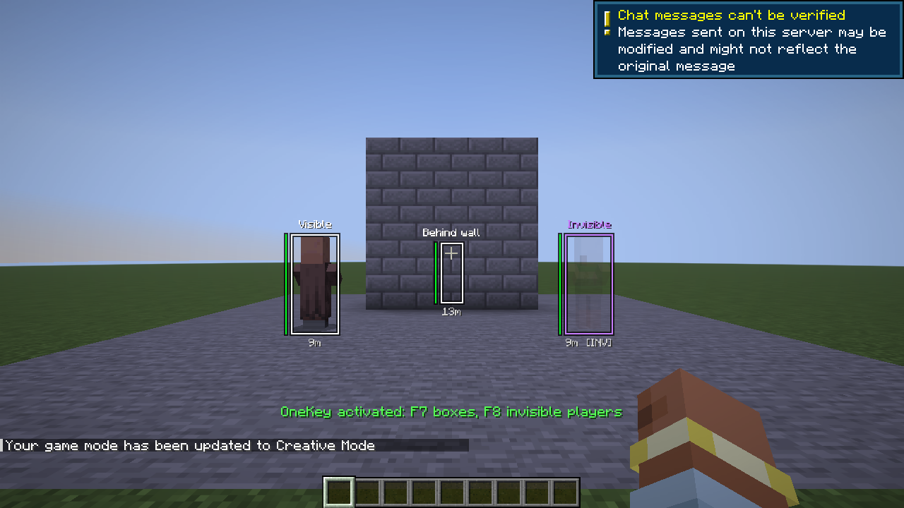

# OneKey

Fabric-мод для Minecraft **26.3**. Ставится и на сервер, и на клиент. Функции включаются, только если игрок ввёл ключ, который выдал сервер.

## Как работает

1. При каждом запуске сервер генерирует ключ вида `K7M2-QX9P` и пишет его в консоль. `/OneKey` (OP) показывает его ещё раз, клик по ключу копирует.
2. Когда игрок с модом заходит на сервер с OneKey, появляется окно «Ключ сервера».
3. Если ключ совпал, сервер включает игроку OneKey. Ключ запоминается для этого сервера, при следующих входах вводить его не нужно, пока ключ не сменится.
4. На сервере без OneKey клиентский мод ничего не делает.

Ключ сравнивается в постоянном времени. После 5 неверных попыток ввод блокируется на минуту.



## Функции

| Клавиша | |
|---|---|
| **F7** | рамки вокруг игроков, как в CS: видны через стены, с ником, дистанцией и полоской здоровья |
| **F8** | невидимые игроки рисуются полупрозрачными и с ником (так, как их видит наблюдатель); их рамка фиолетовая |
| **K** | открыть окно ввода ключа ещё раз |

Клавиши меняются в «Настройки → Управление → OneKey».

## Команды (OP)

```
/OneKey                показать ключ (клик — копировать)
/OneKey new            новый ключ; у всех OneKey выключается, вводить заново
/OneKey list           у кого сейчас включено
/OneKey revoke <ник>   выключить одному игроку
```

Скриншоты сняты автотестом. В одиночном клиенте второго игрока нет, поэтому в тесте вместо игроков стоят жители: видимый, невидимый (фиолетовая рамка, полупрозрачный) и один за стеной.

## Сборка

```
./gradlew build
./gradlew runClientGameTest   # клиент + выделенный сервер, скриншоты всех шагов
```
